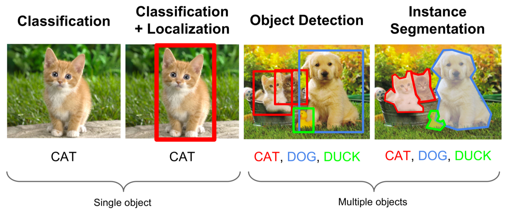
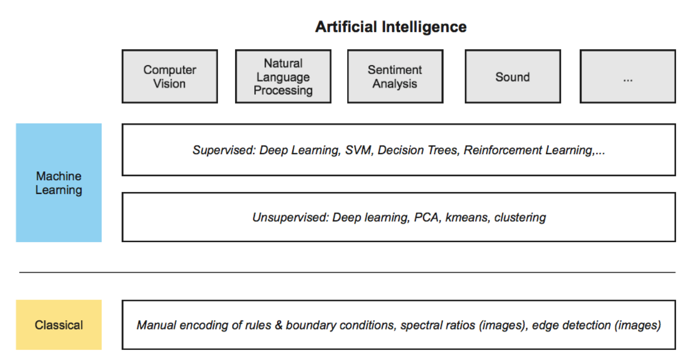
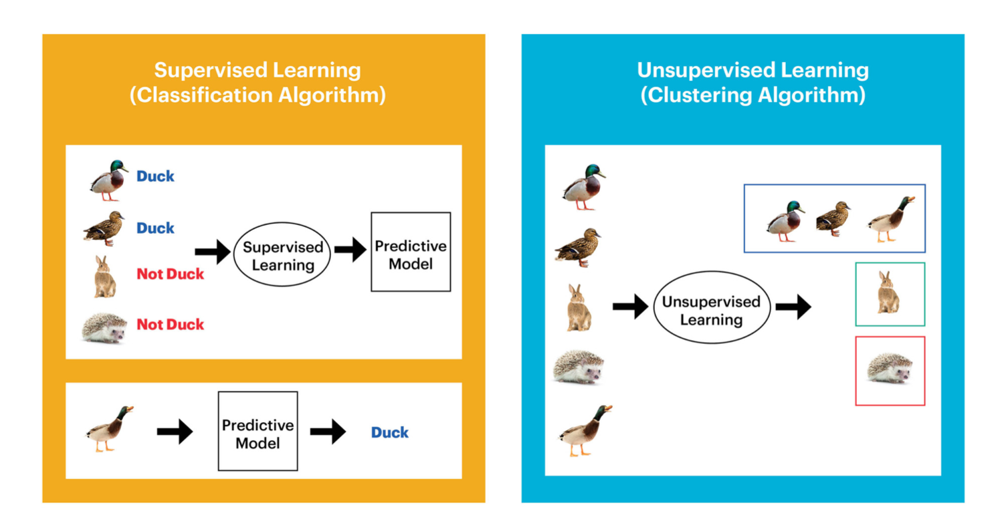
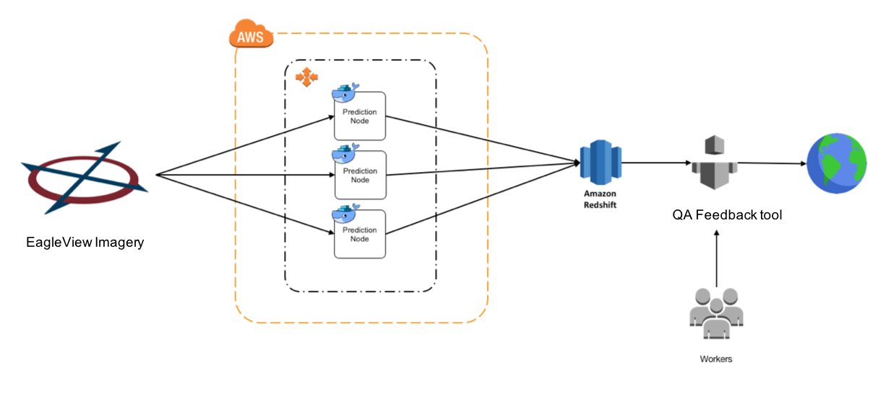
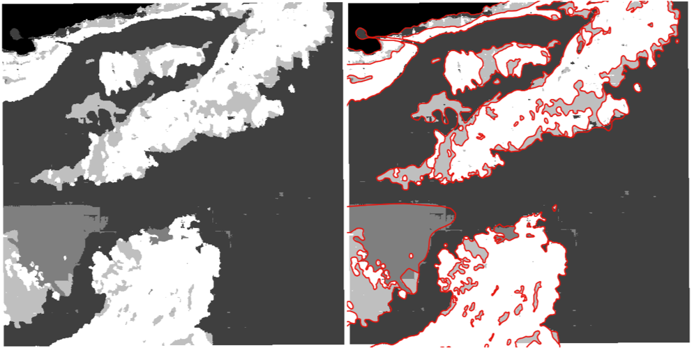
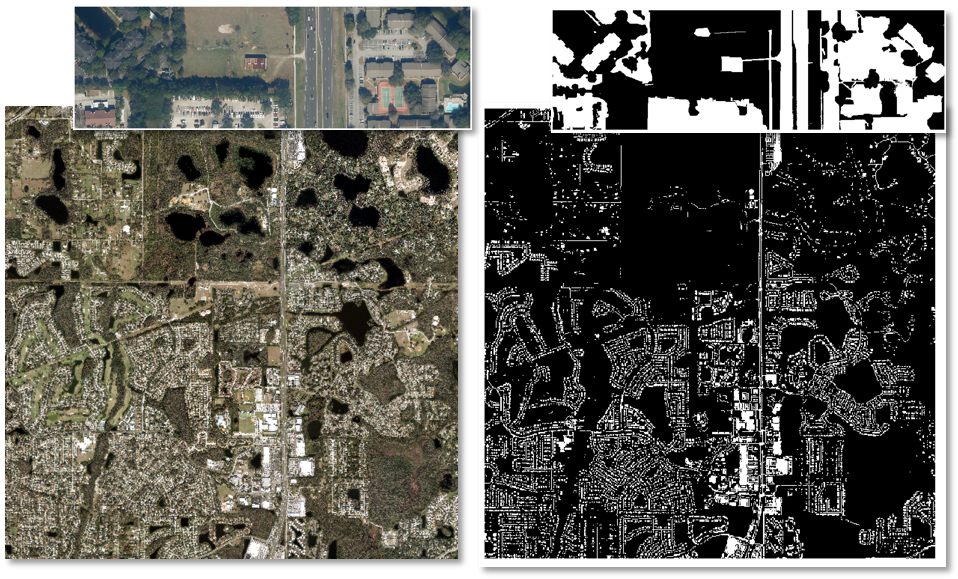

# What is Machine Learning (ML)?

Machine learning is a general term used to apply to many techniques which utilize statistical iteration and feedback so that correlations or logic is learned rather tha dictated.

Learning itself is the act of gradually improving performance on a task without being explicitly programmed. This process mimics human neurological functions.

## ML as AI

<i> Machine learning is a component of artificial intelligence (AI) (a broader subject). There are many subject areas where ML may be applied, e.g. sound, language, and vision (essentially, traits we can identify with as a human). We can differentiate between machine learning and classical techniques. </i>

## Computer Vision Applications

<i> Images as RGB digital counts. </i>

<i> Semantic segmentation is the act of labelling each individual pixel. </i>

## Supervised vs. Unsupervised

<i> Supervised classification vs. unsupervised. </i>

## ML Ethics

[Articles about bias/politics/etc](https://medium.com/@eirinimalliaraki/toward-ethical-transparent-and-fair-ai-ml-a-critical-reading-list-d950e70a70ea)

## ML Scalability

1. Making sense of pedabytes of imagery in a consistent way
1. Human feedback loop (QA/QC)

## GIS is Ideal for ML

Example Use Cases:

1. Land classification (vegetation monitoring, growth, decline, change)
1. Impervious surface
1. Change detection/anomaly
1. Geosptatial attribute trending (census, twitter)
1. Agriculture
1. Road networks
1. Object identification & tracking (ships, cars)
1. Imagery mosaicing, stitching, pre-processing
1. Resolution enhancement
1. 3D modeling & Digital Elevation/Surface Mapping
1. Coastal vegetation monitoring

<i> Pedabytes of imagery may be processed repeatable, and quickly in the cloud, using ML techniques. </i>

<i> FL seagrass ground truth. </i>

<i> FL seagrass ML prediction mapping. </i>

<i> Impervious surface mapping (RGB left, boolean prediction map right). </i>

